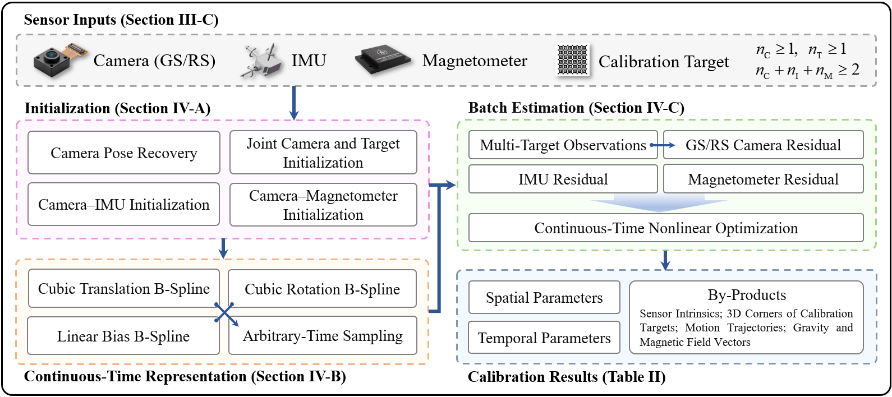

	

<h2 align="center">
	A Unified Spatiotemporal Calibration Framework for Heterogeneous Multi-Sensor Systems in Extended Reality
</h2>

	

## 📖 Overview

XR-UCalib is a unified spatiotemporal calibration framework designed for heterogeneous multi-sensor extended reality (XR) systems, with the following key features:

- **Unified Calibration for Heterogeneous Systems**
	It enables unified calibration for sensor modalities commonly used in modern XR systems, with support for arbitrary sensor counts. By avoiding sequential sensor-wise processing, it prevents error accumulation and ensures global consistency. The framework currently covers **global- and rolling-shutter cameras, IMUs, and magnetometers**, and can be readily extended to additional sensor modalities.

- **Joint spatial and temporal estimation**
	It jointly estimates **spatial** parameters (extrinsic rotations and translations) and **temporal** parameters (sensor time offsets) in a single continuous-time optimization framework.

- **Flexible target configuration for low-overlap camera rigs**
	Unlike conventional single-board calibration, XR-UCalib supports an arbitrary number of fiducial targets (e.g., AprilTag boards), enabling robust calibration for **low-overlap** and even **non-overlap** camera setups commonly encountered in XR systems.

System flowchart is shown below.

---

## 📝 Notes

The paper associated with this project is currently under review. The full source code, documentation, and datasets will be released upon acceptance. Stay tuned!
